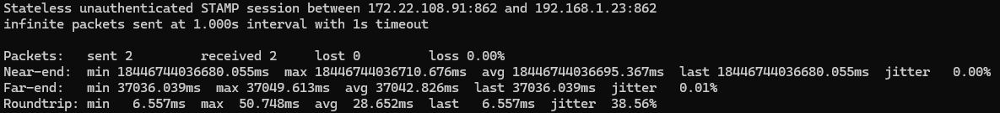

# STAMP implementation for Go
This is a STAMP Protocol([RFC 8762](https://datatracker.ietf.org/doc/html/rfc8762)) implementation using Go and eBPF. So far it only implements stateless unauthenticated mode and only supports amd64(if you have an ARM machine please consider contributing to a port!). It's a fully functional implementation, although I've yet to test it against an actual STAMP-capable network device like Cisco or Juniper.


## Requirements
- 6.6 kernel
- either root(sudo) or [Linux capabilities](#caps)

## Caps
- Capabilities are special privileges that are set per-program basis
- BPF portion requires CAP_BPF and CAP_NET_ADMIN
- CAP_NET_BIND_SERVICE is required for `sender` if we dial from **SOURCE** port 862
- Bash: `sudo setcap 'cap_bpf=ep cap_net_admin=ep cap_net_bind_service=ep' <binary>` to give caps to your binary
- You can also set them in Docker Compose(utilized in the demo)

## Demo
You're provided with a quick proof-of-concept demo that uses Docker to simulate a STAMP session. Unzip and run `demo.sh`.

## Reflector
`reflector` takes interface name, attaches to that interface and listens(not really since it's a BPF filter) on port 862 (`-p` to specify another):
```
reflector eth0 -p 1000
```
`reflector` can handle several sessions at once and doesn't keep track of individual sessions (stateful mode) at this time. 

**IMPORTANT**: `reflector` needs to remain running in order for the program to function; use `&` if you'll need to use the same shell

## Sender
`sender` takes interface name and IP, attaches the BPF components to provided interface and starts sending packets to that IP to and from port 862(`-d` and `-s` respectively to specify a different port):
```
sender eth0 111.222.33.44 -c100 -i 0.5 -d 1000 -s 1001
```
There are `ping`-like options for packet count(`-c`) and send interval(`-i`). If you specified a finite number of packets to send it will quit on its own once all packets are accounted for(received or lost). It only does one STAMP session at a time. 

## Troubleshooting
`stamp-bpf` emits descriptive messages in case of error, however, not every error can be accounted for so here's some pointers for potential problems. Also see [here](#desync) for potential clock synchronization issues.

### BPF
If instead of `All programs successfully loaded and verified` line you get an error, it means the BPF program has failed to load. Obviously, I test my code to ensure this doesn't happen, so any and all such occurences are likely caused by system configuration. Make sure your kernel version matches the requirements, or there are possibly some [kernel flags](https://eunomia.dev/en/tutorials/bcc-documents/kernel_config_en/) that are missing.

### Network issues
Once the program has successfully started, you might see that packets are being sent but none are coming back. 
- Check your network and/or firewall configuration - something might be blocking traffic
- Make sure reflector is running on the receiving side
- Make sure you're sending packets to the right IP
- Make sure you're listening on the correct network device - both for sender and reflector
- If all else fails and you're filing a bug report, please include a Wireshark pcap from both sender and reflector sides if possible

## Clock syncing
It's important to have clock synchronization between the two machines to ensure precise measurements; however, due to overall complexity of the topic, system clock synchronization is largely left up to the system admin. Nonetheless, there are some features present to help you figure things out.

### TAI offset
TAI is the only clock that's available for eBPF programs([docs](https://docs.ebpf.io/linux/helper-function/bpf_ktime_get_tai_ns/)) so this is what we use for measurements. There is a problem, however: TAI clock is supposed to be offset from UTC by a number of leap seconds(37 as of 2025), which isn't guaranteed on all systems and can produce considerable desync if one machine has its TAI clock offset and the other doesn't. `stamp-bpf` can automatically detect and account for this, adding 37 seconds to its TAI clock if needed. [See here if you want to fix this on your system](https://superuser.com/questions/1156693/is-there-a-way-of-getting-correct-clock-tai-on-linux), although it's not necessary for this program to function. 

### System synchronization
`stamp-bpf` also offers clock synchronization detection, which comes in two flavors: general sync detection and PTP detection. 

#### General sync detection
This works by calling `adjtimex()` and detects if there's any kind of system clock adjustment(implying synchronization effort) going on. Should be reliable for any Linux system.

#### PTP detection
This one is a lot more finnicky and makes some assumptions. Basically, we assume that the system is using `linuxptp` to enable PTP, and given how `linuxptp` tools(namely `ptp4l`) print to systemlog, we use Bash to grep it for recent `ptp4l` records.
This will give a false negative if:
- Your system doesn't have `systemd`
- Your `linuxptp` tools are configured to output no logs
- You're using a different PTP tool(please let me know if you do and I'll do my best to improve detection)
- Your system somehow doesn't have `grep` or `tail`

#### Synchronization enforcement
There are two CLI flags for if you really care about clock syncing and don't want to make measurements unless it is present.
- `--enforce-sync` will abort execution if general sync detection returns a negative
- `--enforce-ptp` will abort execution if PTP detection returns a negative

### Desync
Nonetheless, despite all your efforts, you might see an output that looks like this:

In this case, attempting to calculate latency from two timestamps results in a negative number, which causes a variable overflow. This happens if the delta between two machines' clocks is larger than actual network latency between the machines. It's not necessarily lack of synchronization - in this screenshot, both machines are NTP-synced to the same server, however I'm testing over LAN so the network latency is low enough for this to still happen. Note that you can still trust roundtrip measurement as both timestamps for it are made on the sender machine. If you want to test over low-latency networks like LANs, consider enabling PTP and ensuring both machines syncronize to the same master clock.

(also note that the 37s delay due to lack of TAI offset is present on the far-end, although that isn't the root cause and the issue was still present with TAI clocks properly offset on both machines)

## Histogram
`stamp-bpf` includes option for histogram output. A histogram consists of N bins(configurable), each counting packets that fall into the bin's latency range. It's output in the form of a simple text file, interpretation and visualization of which is left up to the user. 
- `--hist <bins> <min> <max>` in CLI to enable histogram output
- `--histpath <path>` to provide path for output file
- Leftmost and rightmost bins are reserved for outlier packets that fall outside of specified min-max range
- Min-max range is divided equally among the remaining bins
- Each bin counts packets that fell into its range
- For sender, the histogram is saved only when the session concludes, but not when program exits prematurely or it's set to send infinite packets
- For reflector, the histogram is updated on each arriving packet - yes, this doesn't work well when reflector receives several sessions at once, not until I implement Stateful mode. 
- To enable this on the reflector, additionally specify `--output` flag

## Upcoming features
- Stateful mode([RFC](https://datatracker.ietf.org/doc/html/rfc8762#name-theory-of-operation)) - have `reflector` track individual sessions and get directional packet loss measurements at the end of a test.
- Unified binary - `stamp reflector ...` or `stamp sender ...` for easier distribution and deployment. Docker image will be published when this feature is released.
- Network daemon mode for `reflector` - utilize BPF pinning to load, unload and reattach the BPF programs without having to keep the userspace component running similar to `tc qdisc add/change/del` syntax.
- ARM and other architecture support
- Authenticated mode([RFC](https://datatracker.ietf.org/doc/html/rfc8762#name-session-sender-packet-format)) - encrypt your sessions to make sure your measurements can be trusted.
- Protocol extensions - RFCs [8972](https://datatracker.ietf.org/doc/rfc8972/) and [9503](https://datatracker.ietf.org/doc/rfc9503/)

## About STAMP
STAMP is a network performance measurement protocol that provides metrics for individual directions(near-end and far-end). This implementation uses eBPF TC Classifier programs to timestamp the packets directly inside the Linux networking stack to minimize processing delay factor in measurements. 

### Packet flow
0. Sender and reflector BPF programs are loaded and attached ahead of time
1. STAMP packet is formed in the userspace with just the sequence number populated
2. Sender's egress filter catches it and populates Timestamp 1
3. Reflector's ingress filter catches the packet and:
   - Populates Timestamp 2 as soon as the packet arrives
   - Swaps the packet's IP, port and MAC in order to send it back
   - Redirects it back onto the interface
4. Reflector's egress filter catches the outgoing packet and populates Timestamp 3
5. Sender's ingress filter catches the packet coming back and:
   - Notes Timestamp 4 right away
   - Strips the other 3 timestamps from the packet
   - Calculates Near-end, Far-end and Roundtrip latencies off of timestamps...
   - ... and passes that information back to userspace
   - Userspace program processes the samples, calculates the actual metrics and prints them out


(I'll make a better chart soon)
