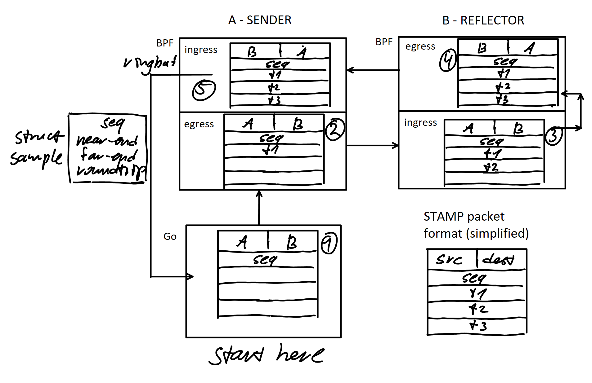

# STAMP implementation for Go
This is a STAMP Protocol([RFC 8762](https://datatracker.ietf.org/doc/html/rfc8762)) implementation using Go and eBPF. So far it only implements stateless unauthenticated mode and only supports amd64(if you have an ARM machine please consider contributing to a port!). It's a fully functional implementation, although I've yet to test it against an actual STAMP-capable network device like Cisco or Juniper.


## Requirements
- 6.6 kernel
- either root(sudo) or [Linux capabilities](#caps)

## Caps
- Capabilities are special privileges that are set per-program basis
- BPF portion requires CAP_BPF and CAP_NET_ADMIN
- CAP_NET_BIND_SERVICE is required for `sender` if we dial from **SOURCE** port 862
- Bash: `sudo setcap 'cap_bpf=ep cap_net_admin=ep cap_net_bind_service=ep' <binary>` to give caps to your binary
- You can also set them in Docker Compose(utilized in the demo)

## Demo
You're provided with a quick proof-of-concept demo that uses Docker to simulate a STAMP session. Unzip and run `demo.sh`.

## Reflector
`reflector` takes interface name, attaches to that interface and listens(not really since it's a BPF filter) on port 862 (`-p` to specify another):
```
reflector eth0 -p 1000
```
`reflector` can handle several sessions at once and doesn't keep track of individual sessions (stateful mode) at this time. 

**IMPORTANT**: `reflector` needs to remain running in order for the program to function; use `&` if you'll need to use the same shell

## Sender
`sender` takes interface name and IP, attaches the BPF components to provided interface and starts sending packets to that IP to and from port 862(`-d` and `-s` respectively to specify a different port):
```
sender eth0 111.222.33.44 -c100 -i 0.5 -d 1000 -s 1001
```
There are `ping`-like options for packet count(`-c`) and send interval(`-i`). If you specified a finite number of packets to send it will quit on its own once all packets are accounted for(received or lost). It only does one STAMP session at a time. 

## Upcoming features
- Stateful mode([RFC](https://datatracker.ietf.org/doc/html/rfc8762#name-theory-of-operation)) - have `reflector` track individual sessions and get directional packet loss measurements at the end of a test.
- Unified binary - `stamp reflector ...` or `stamp sender ...` for easier distribution and deployment. Docker image will be published when this feature is released.
- Network daemon mode for `reflector` - utilize BPF pinning to load, unload and reattach the BPF programs without having to keep the userspace component running similar to `tc qdisc add/change/del` syntax.
- ARM and other architecture support
- Authenticated mode([RFC](https://datatracker.ietf.org/doc/html/rfc8762#name-session-sender-packet-format)) - encrypt your sessions to make sure your measurements can be trusted.
- Protocol extensions - RFCs [8972](https://datatracker.ietf.org/doc/rfc8972/) and [9503](https://datatracker.ietf.org/doc/rfc9503/)

## About STAMP
STAMP is a network performance measurement protocol that provides metrics for individual directions(near-end and far-end). This implementation uses eBPF TC Classifier programs to timestamp the packets directly inside the Linux networking stack to minimize processing delay factor in measurements. 

### Packet flow
0. Sender and reflector BPF programs are loaded and attached ahead of time
1. STAMP packet is formed in the userspace with just the sequence number populated
2. Sender's egress filter catches it and populates Timestamp 1
3. Reflector's ingress filter catches the packet and:
   - Populates Timestamp 2 as soon as the packet arrives
   - Swaps the packet's IP, port and MAC in order to send it back
   - Redirects it back onto the interface
4. Reflector's egress filter catches the outgoing packet and populates Timestamp 3
5. Sender's ingress filter catches the packet coming back and:
   - Notes Timestamp 4 right away
   - Strips the other 3 timestamps from the packet
   - Calculates Near-end, Far-end and Roundtrip latencies off of timestamps...
   - ... and passes that information back to userspace
   - Userspace program processes the samples, calculates the actual metrics and prints them out


(I'll make a better chart soon)
